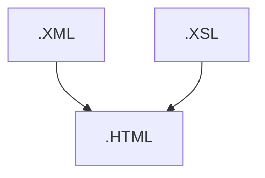

# FrebToHMTL
Utility to convert XML Freb traces to HTML with all features
Taking IIS Failed Request Traces that need an XML and and XSL to render and converting them to a self-contained HTML. 

```mermaid
graph TD;
    .XML-->.HTML;
    .XSL-->.HTML;
```